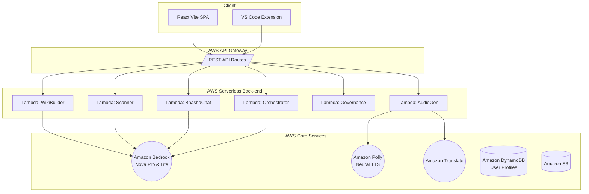

# Synthetix Project Blueprint & Documentation

## 1. Project Overview
**Synthetix** is a localized, AI-powered developer platform tailored specifically for Indian software engineers. It solves the friction of monolingual (English-only) developer tools by bringing AI architecture mapping, security scanning, multi-lingual "Bhasha" chat, and audio walkthroughs directly native Indian languages. 

The application is built around AWS Serverless infrastructure to ensure enterprise-grade scaling and cost efficiency, paired with a dynamic React frontend and a native VS Code extension.

---

## 2. Global Architecture Ecosystem

---

## 3. Frontend Architecture (React + Vite)
Located in `/frontend`. Designed with a premium minimalist dark/light theme, featuring dynamic routing and state.

### Key Components:
- **`App.jsx`**: The main orchestration layout containing the Monaco Editor pane and output tabs. Handles Auth state and DynamoDB profile saving.
- **`WikiViewer.jsx`**: The primary documentation render engine. Renders Markdown, displays Mermaid diagrams, and provides the localized Audio Playback ("Listen") functionality.
- **`BhashaChat.jsx`**: A floating AI chat assistant widget allowing users to ask codebase questions in 14 Indian languages.
- **`GreenOpsPanel.jsx`**: A sustainability dashboard measuring AWS Carbon Footprint impacts of the code logic.
- **`SipTracker.jsx`**: A governance and audit tracker (Synthetix Improvement Proposals) querying the GitHub API for issues tagged `SIP`.
- **`utils/translations.js`**: The dictionary map powering dynamic localization for UI elements across 14 languages including Sanskrit, Hindi, Tamil, Telugu, and more.

---

## 4. Serverless Backend Engine (AWS)
Located in `/serverless-backend`. Built entirely using the Serverless Framework (`serverless.yml`) orchestrating AWS native services.

### Core Handlers (`handler.js`):
1. **`queryProcessor (/api/chat)`**: Powers "Bhasha-Chat" and "Explain Selection" using Amazon Bedrock (`amazon.nova-lite-v1:0`). Also detects keywords via Amazon Comprehend.
2. **`audioGenerator (/api/audio)`**: Handles the Audio Walkthroughs. Due to AWS Polly constraints over regional scripts, it automatically uses **Amazon Translate** to map unsupported scripts (e.g., Tamil, Telugu, Bengali) to English before synthesizing via Amazon Polly's Indian-English *Kajal* voice.
3. **`wikiBuilder (/api/generate-wiki)`**: Heavy-lift parser using AWS Bedrock (`amazon.nova-pro-v1:0`) to analyze code, extract Mermaid architectural diagrams, and prepare the audio script. 
4. **`securityScanner (/api/scan)`**: Detects security vulnerabilities in pasted code snippets.
5. **`getProfile` & `saveProfile`**: Stateful user preference management pushing to **Amazon DynamoDB** (`UserProfiles` table).
6. **`orchestrator (/api/orchestrate)`**: Chained-agent pipeline connecting Scanner -> Verifier -> Synthesizer sequentially.
7. **`contentAdapter (/api/adapt)`**: Adapts technical output based on developer skill level (`junior` vs `senior`).

---

## 5. VS Code Extension
Located in `/vscode-extension`. Brings Synthetix natively into the developer's default IDE. Requires the backend to be running.

### Key Capabilities:
- **Bhasha-Chat Sidebar Panel**: A webview container allowing localized querying directly in VS Code.
- **Inline Hover Provider (Explain)**: AI-driven localized explanations of highlighted code variables/functions via a tooltip hover window.
- **Auto-Docs Engine**: Listens to file changes and aggressively syncs with `wikiBuilder` to auto-generate architecture schemas on file save.
- **Native Audio Playback**: Highlighting code and triggering `synthetixDocsMaker.playAudio` fetches and plays the AWS Polly explanation via a hidden webview.

---

## 6. Current Database Infrastructure (`serverless.yml`)
- **`UserProfiles` (DynamoDB)**: Tracks settings such as active Language, active Skill-Level.
- **`LearningPaths` (DynamoDB)**: Tracks gamified badges and progress.
- **`UserChatHistory` (DynamoDB)**: Multi-turn prompt context.
- **`CognitoUserPool`**: Amazon Cognito infrastructure for user authentication.

---

## 7. Future Developments & Roadmap
While the application currently supports standalone functionality, the following blueprint areas are designed for phase-two scaling:

1. **AWS OpenSearch Serverless (Vector RAG)**: 
   - *Goal*: Synthetix currently analyzes individual code snippets. Expanding this to full-repository context requires vector search.
   - *Status*: The configuration schema is already drafted inside `serverless.yml` as a placeholder. Future development will embed the codebase into the OpenSearch domain so BhashaChat can answer questions like "Where is the authentication handled in this repo?".

2. **Full DynamoDB Gamification Hooks**:
   - *Goal*: The `LearningPaths` DynamoDB table has been created, but requires the frontend profile modal to track points, badges, and learning progressions based on successful security audits resolved by the developer.

3. **Multi-File Orchestration (Backend)**:
   - *Goal*: Upgrading the `orchestrator` lambda to ingest an AWS S3 zip payload allowing the "Agent Pipeline" to read multiple files simultaneously instead of a single editor file context.

4. **IDE Porting**:
   - *Goal*: Transpiling the `vscode-extension` logic over to IntelliJ (Java/Kotlin) plugins, ensuring the Indian developer ecosystem is covered across IDEs.
